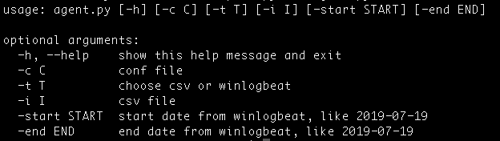

An easy ATT&CK-based Sysmon hunting tool
===

# Requirements

1. Elasticsearch
2. Neo4j
3. Python 2.7.x
4. 3rd party python library dependency
   
    pip install -r requirements.txt

# Configuration

See conf/example.conf
	
	es_host=http://localhost:9200			# Elasticsearch host uri
	winlogbeat_index=winlogbeat-*			# winlogbeat index prefix
	neo4j_host=bolt://localhost:7687		# Neo4j database host
	neo4j_user=neo4j							# Neo4j login username
	neo4j_pwd=								# Neo4j login password
	attck_yaml=misc/attck.yaml				# rules file
	
# Usage

## Data process & import

Processing Sysmon logs to customized structured data, filtering abnormal behaviors based on YAML rules, then import to databases.

Sysmon logs supports two ways to collect.

* manully, using `logparser` transfer .evtx to csv.
	
		logparser.exe -i:evt -o:csv "select TimeGenerated, SourceName, ComputerName, SID, EventID, Strings from Microsoft-Windows-Sysmon%4Operational.evtx

* with `winlogbeat` collect to elasticsearch.

Usage for `agent.py`:

For examples:

	python agent.py -c conf/example.conf -t csv -i test/empire.csv
	python agent.py -c conf/example.conf -t winlogbeat -start 2019-07-19 -end 2019-07-19
	
## SysmonHunter tool

Execute command below and open `http://localhost:5000/` in browser.

	python server.py -c conf/example.conf
	
# Conclusion

More details include in the pptx under `docs`.